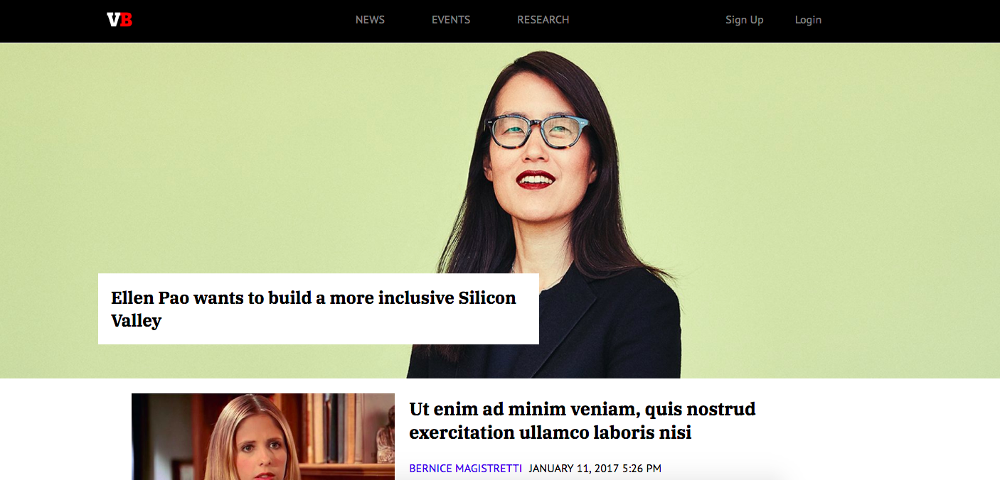
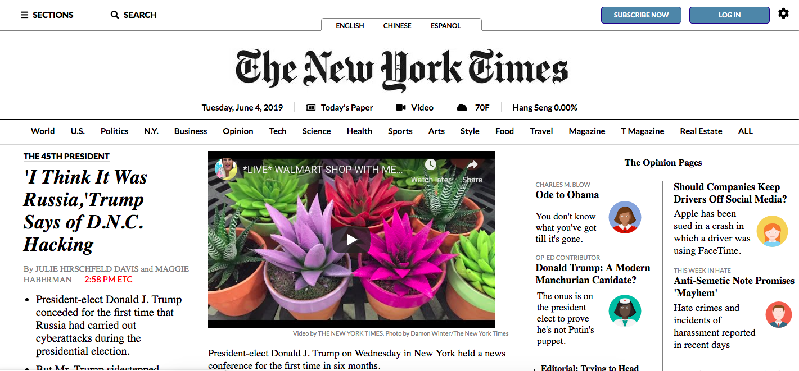
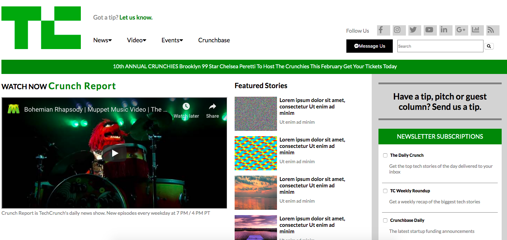

# Project
This is a collection of popular news websites and blogs I have recreated.

## How It's Made:

**Tech used:** HTML, CSS, JavaScript
I started off with printing out images of the original websites and outlining what the sections, headers, navs, footer, etc, might be
and the proceeded to build out the wireframe in HTML. I then started on the CSS and gave everything a border to help visualize
the positioning of the elements only using floats, margins, padding, etc. I finished off each website by adding in special fonts,
colors, and images if needed.

## Lessons Learned:

Some important takeaways from working on this series was learning the semantic HTML, specificity, pseudo-selectors, and
properties and values.
